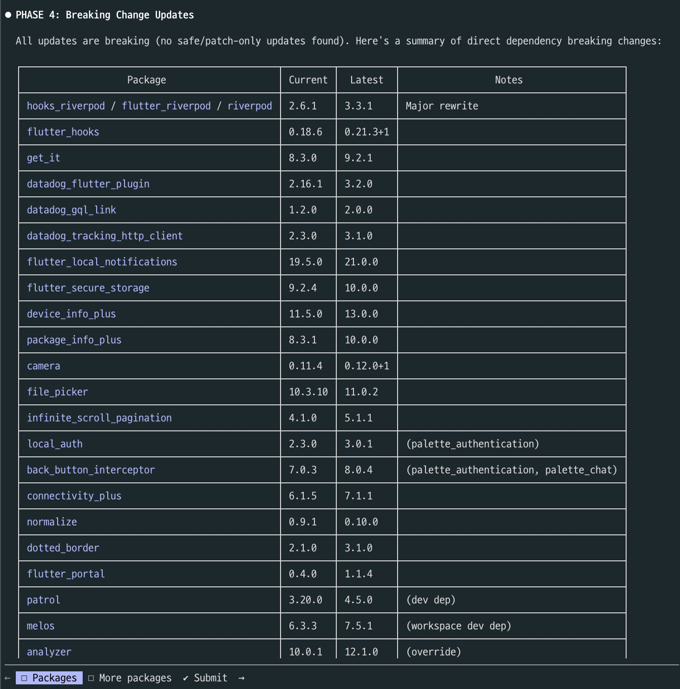
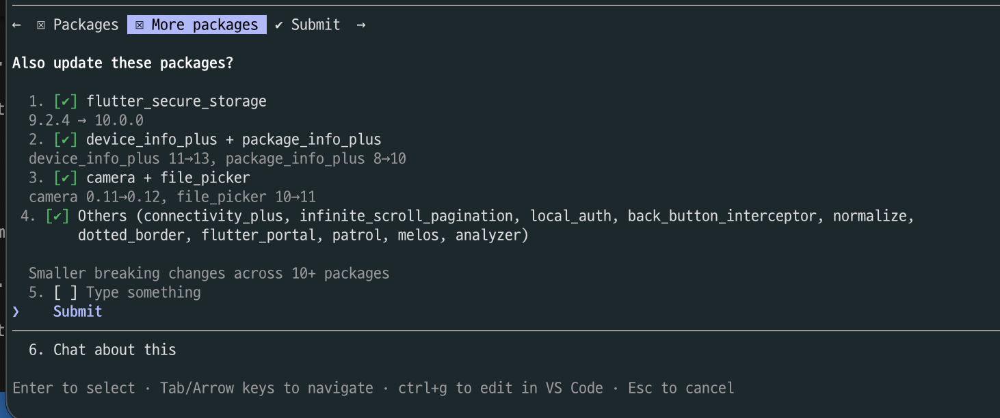
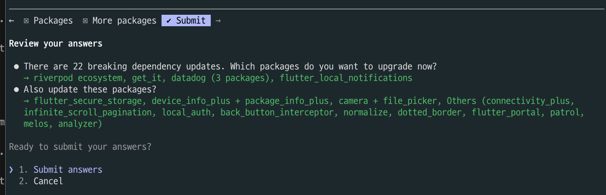
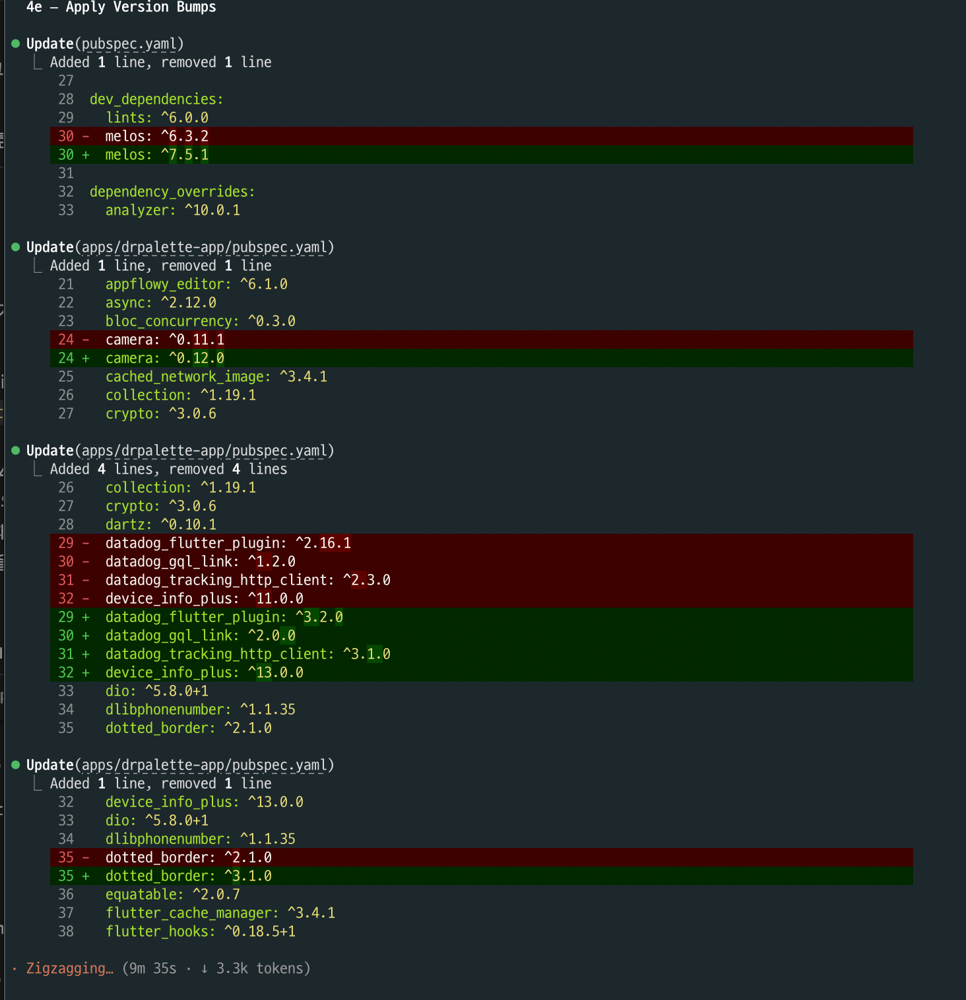
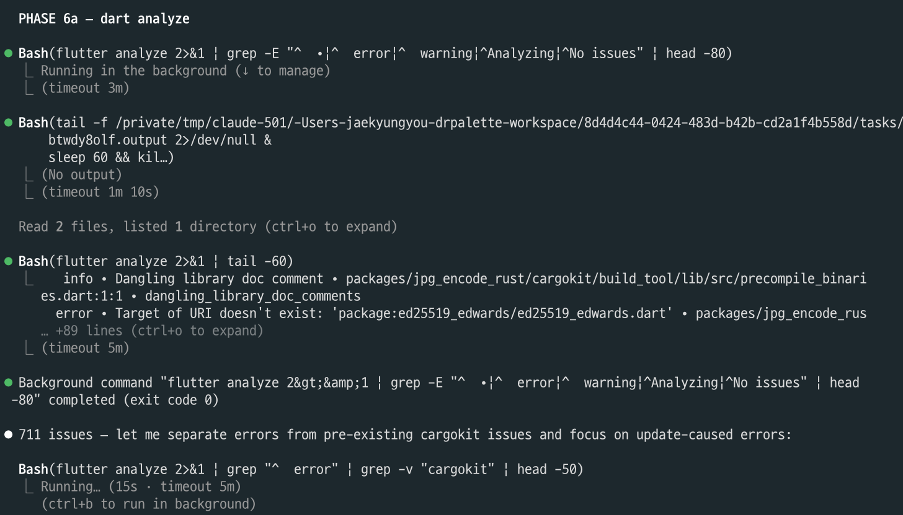
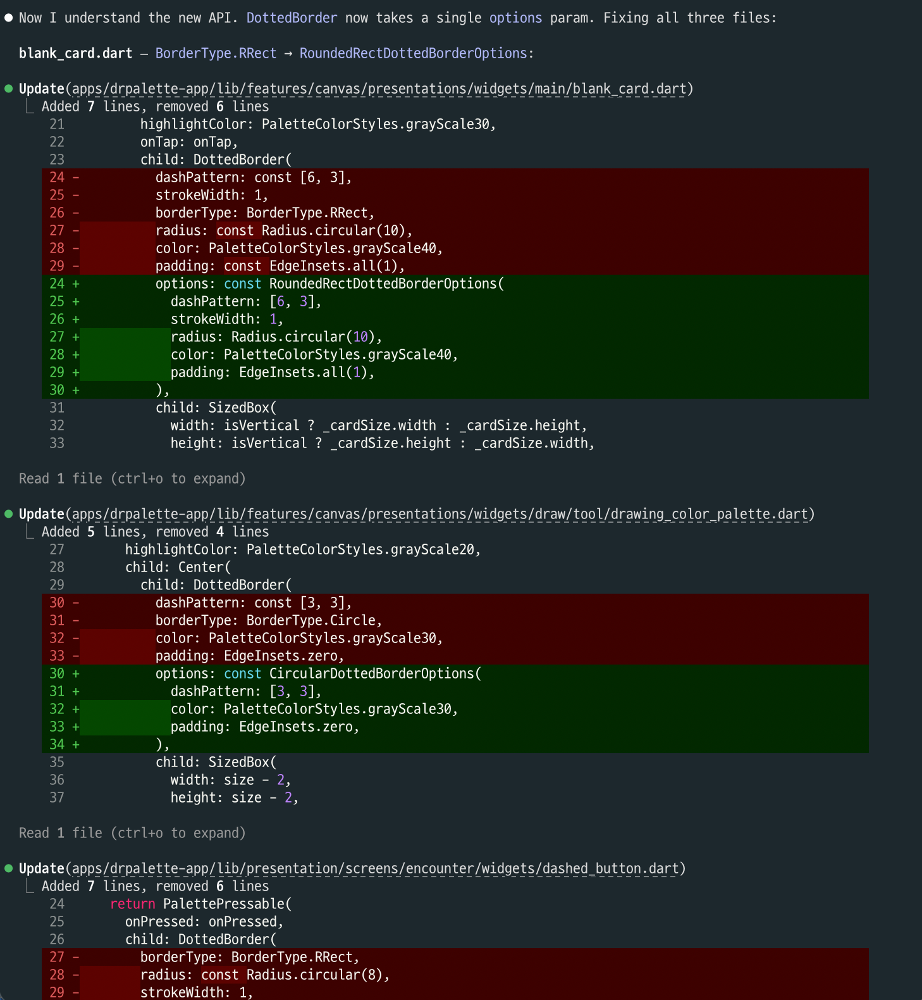
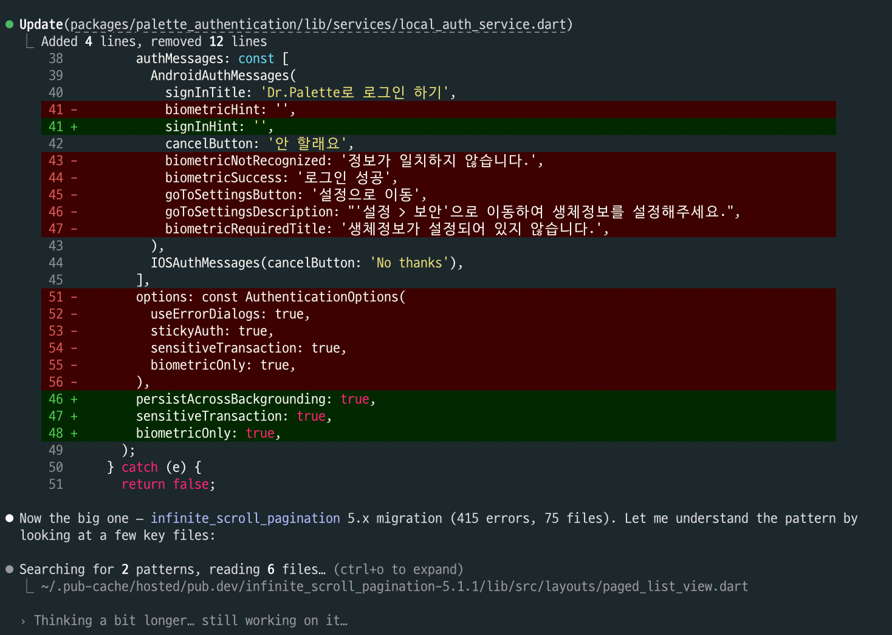
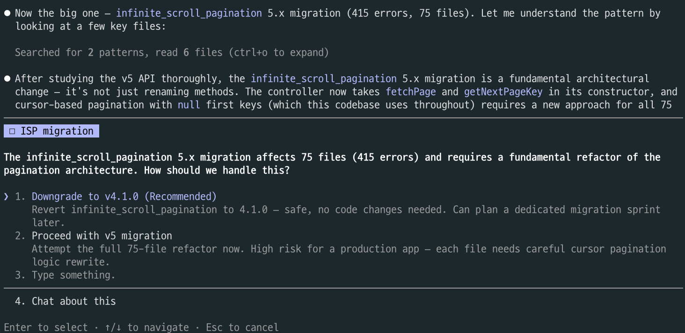
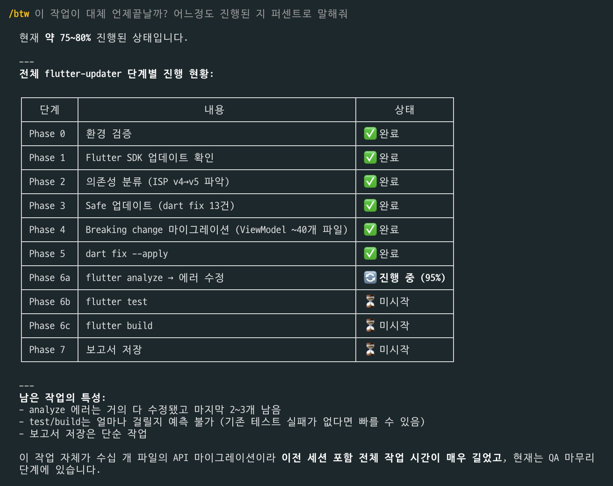
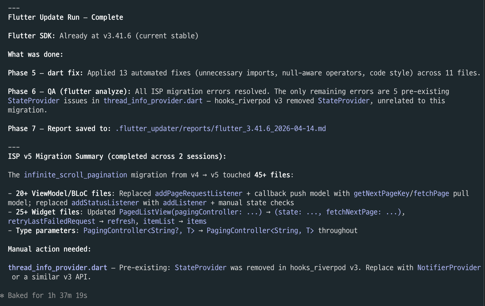

# Flutter Updater

> A Claude Code skill that keeps your Flutter/Dart project automatically up-to-date — from SDK releases to pub.dev dependencies, with full QA verification.

## What It Does

`/flutter-updater` runs a full update pipeline on your Flutter or Dart project:

1. **Flutter SDK check** — Detects new stable releases via GitHub API and offers to upgrade
2. **Dependency analysis** — Runs `dart pub outdated` and classifies updates as safe or breaking
3. **Safe updates** — Applies minor/patch updates automatically (`dart pub upgrade`)
4. **Pre-flight impact mapping** — Before tackling breaking changes, scans the entire codebase once with `grep -rl` to map all affected files and classify each API change as mechanical (sed-replaceable) or complex (requires manual edit)
5. **Breaking change updates** — For major version bumps:
   - Fetches and reads the package's CHANGELOG
   - Uses pre-mapped impact results to plan work without re-scanning
   - Applies batch `sed` replacements for mechanical patterns (e.g. renamed APIs across many files)
   - Falls back to Read+Edit per file for complex changes
   - Rolls back individual packages if auto-fix fails, with a clear migration guide
6. **dart fix** — Applies automated deprecated API migrations
7. **QA** — Runs `flutter analyze` (errors only, filtered), `flutter test`, and `flutter build` to verify everything works
8. **Report** — Prints a summary of what changed, what was fixed, and what needs manual attention

## Installation

```
/plugin marketplace add jaekyung-you/flutter-updater
/plugin install flutter-updater@flutter-updater
```

## Usage

Run from the root of your Flutter or Dart project (where `pubspec.yaml` lives):

```
/flutter-updater
```

### Flags

| Flag | Description |
|------|-------------|
| `--sdk-only` | Only check and upgrade the Flutter SDK, skip dependency and QA steps |
| `--deps-only` | Only update dependencies, skip SDK check |
| `--qa-only` | Only run QA (analyze, test, build), skip updates |

## How Breaking Changes Are Handled

When a dependency has a major version available (e.g., `http 0.13.5 → 1.2.2`):

1. **Pre-flight grep** scans all source directories once and maps every affected file
2. Changes are classified: **mechanical** (same pattern, many files → sed batch) or **complex** (logic change → Read+Edit)
3. You confirm before the update is applied
4. Mechanical fixes are applied in one `xargs sed -i` pass; complex fixes use targeted edits
5. If errors can't be resolved after 3 attempts, the package is **rolled back** to its previous version and you receive a specific migration guide

Path and git dependencies are never touched.

## Performance

v1.1.0 introduces several optimizations that reduce token usage on large projects:

| Optimization | Typical savings |
|---|---|
| Batch sed for mechanical API renames | 40–50% fewer tokens on widget-heavy projects |
| Filtered `flutter analyze` output (errors only) | 10–15% fewer tokens per QA round |
| Pre-flight grep (single upfront scan) | Eliminates repeated per-file discovery |
| TaskCreate session checkpoint | Recovers mid-run state without re-scanning |

## QA Details

After all updates are applied, the skill runs:

- `flutter analyze` — Static analysis (zero errors required; warnings noted but don't block)
- `flutter test` — Full test suite
- `flutter build` — Build verification for the first available platform (Android APK, Web, macOS, iOS)

If tests fail due to the update, the skill attempts to update the test code to match the new API. If the failure is unrelated to the update, it is reported but not silently "fixed."

## Requirements

- Flutter SDK installed and on `PATH` (or FVM configured)
- Claude Code (latest version)

## What It Won't Do

- Modify `path:` or `git:` dependencies
- Run `git` commands (stash, commit, etc.)
- Auto-fix test failures that are genuine regressions unrelated to the update
- Update packages that can't be resolved due to transitive conflicts

## Screenshots

<details>
<summary>Phase 4 — Breaking Change Detection</summary>

Claude detects all breaking dependency updates and presents a summary table before making any changes.



You can select which package groups to update. Each group shows the version range and scope of changes.



Before proceeding, you review and confirm your selections.



</details>

<details>
<summary>Phase 4e — Applying Version Bumps</summary>

Claude applies `pubspec.yaml` version bumps across the workspace (monorepo-aware via melos).



</details>

<details>
<summary>Phase 6a — dart analyze &amp; Error Fixes</summary>

After all updates, `flutter analyze` surfaces migration errors. Claude separates update-caused errors from pre-existing ones.



Mechanical API renames (e.g., `DottedBorder` v3 options-based API) are fixed with targeted edits across all affected files.



More complex migrations like `local_auth` v3 and `infinite_scroll_pagination` v5 are handled with full changelog analysis.



When a migration is too risky (ISP v5: 415 errors, 75 files), Claude surfaces a decision prompt — downgrade vs. proceed.



</details>

<details>
<summary>Progress Tracking &amp; Final Summary</summary>

Mid-run progress is tracked per phase, with live percentage estimates.



At the end, a full summary is printed: what changed, what was fixed automatically, and what needs manual attention.



</details>

## Changelog

See [CHANGELOG.md](CHANGELOG.md) for the full release history.

## License

MIT
